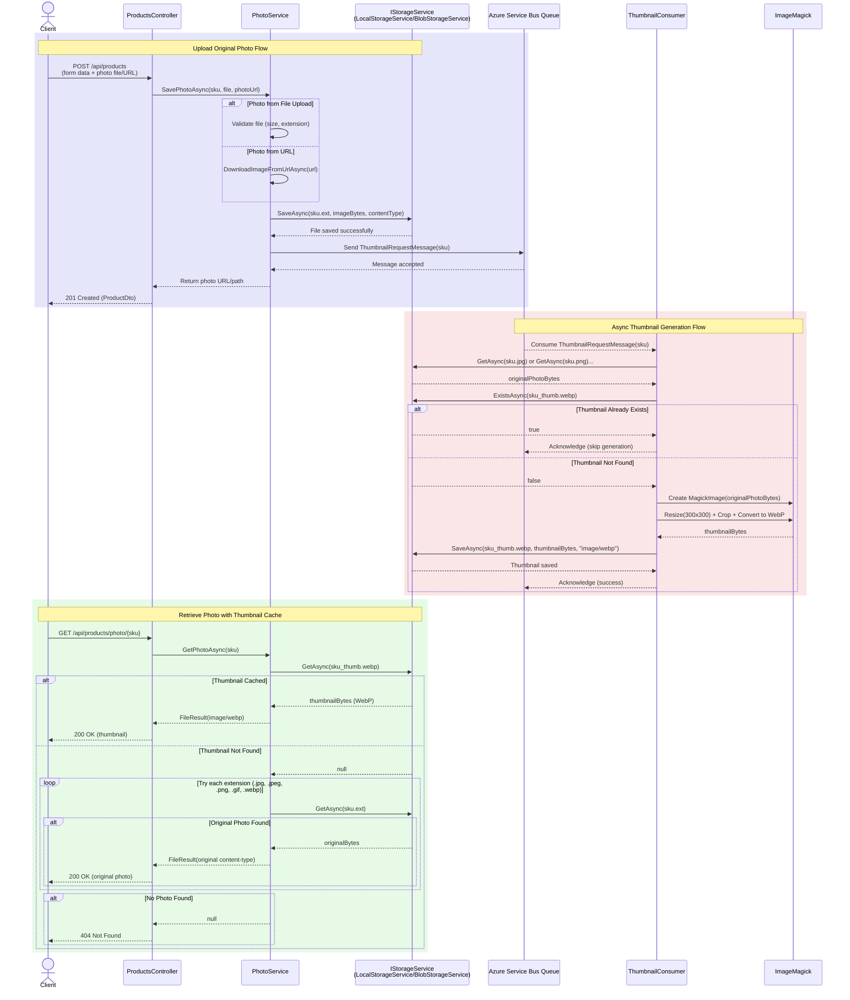

# Thumbnail Generation Flow Diagrams

## Sequence Diagram



## High-Level Design Flowchart (HLD)

```mermaid
flowchart TD
    Start([Client Request]) --> RequestType{Request Type?}
    
    RequestType -->|POST /api/products| UploadFlow
    RequestType -->|GET /api/products/photo/{sku}| RetrieveFlow
    
    subgraph UploadFlow["Upload Original Photo Flow"]
        UploadFlow --> ProductsController[ProductsController]
        ProductsController --> PhotoService[PhotoService.SavePhotoAsync]
        PhotoService --> Validate{Photo Source?}
        Validate -->|File Upload| ValidateFile[Validate File<br/>Size, Extension]
        Validate -->|URL| DownloadImage[DownloadImageFromUrlAsync]
        ValidateFile --> SaveOriginal[IStorageService.SaveAsync<br/>sku.ext]
        DownloadImage --> SaveOriginal
        SaveOriginal --> SendMessage[Send ThumbnailRequestMessage<br/>to Azure Service Bus Queue]
        SendMessage --> ReturnSuccess[Return 201 Created]
    end
    
    subgraph AsyncThumbnail["Async Thumbnail Generation"]
        ServiceBus[Azure Service Bus Queue] --> ThumbnailConsumer[ThumbnailConsumer.Consume]
        ThumbnailConsumer --> GetOriginal[IStorageService.GetAsync<br/>Find original photo by SKU]
        GetOriginal --> CheckCache{Thumbnail<br/>Exists?}
        CheckCache -->|Yes| Skip[Skip Generation<br/>Acknowledge Message]
        CheckCache -->|No| GenerateThumbnail[ImageMagick<br/>Resize 300x300<br/>Convert to WebP]
        GenerateThumbnail --> SaveThumbnail[IStorageService.SaveAsync<br/>sku_thumb.webp]
        SaveThumbnail --> Acknowledge[Acknowledge Message]
    end
    
    subgraph RetrieveFlow["Retrieve Photo with Cache Flow"]
        RetrieveFlow --> GetPhoto[ProductsController<br/>GET /api/products/photo/{sku}]
        GetPhoto --> PhotoServiceGet[PhotoService.GetPhotoAsync]
        PhotoServiceGet --> CheckThumbnail{IStorageService.GetAsync<br/>sku_thumb.webp}
        CheckThumbnail -->|Found| ReturnThumbnail[Return Thumbnail<br/>image/webp]
        CheckThumbnail -->|Not Found| TryOriginal[Try Original Photo<br/>Loop through extensions]
        TryOriginal --> OriginalFound{Original<br/>Found?}
        OriginalFound -->|Yes| ReturnOriginal[Return Original Photo<br/>with original content-type]
        OriginalFound -->|No| Return404[Return 404 Not Found]
    end
    
    SaveOriginal -.->|Triggers| ServiceBus
    ReturnSuccess --> End1([End])
    ReturnThumbnail --> End2([End])
    ReturnOriginal --> End2
    Return404 --> End2
    Skip --> End3([End])
    Acknowledge --> End3
    
    style UploadFlow fill:#e6e6fa
    style AsyncThumbnail fill:#ffe6e6
    style RetrieveFlow fill:#e6fae6
    style SaveThumbnail fill:#fffacd
    style CheckThumbnail fill:#fffacd
```

## Component Overview

### Components Used:
- **ProductsController**: API endpoint controller handling product CRUD and photo requests
- **PhotoService**: Service handling photo upload, download, and retrieval logic
- **IStorageService**: Storage abstraction (LocalStorageService for dev, BlobStorageService for production)
- **Azure Service Bus Queue**: Message queue for async thumbnail generation requests
- **ThumbnailConsumer**: MassTransit consumer processing thumbnail generation messages
- **ImageMagick**: Image processing library for thumbnail generation

### Key Features:
1. **Thumbnail Caching**: Thumbnails are stored as `{sku}_thumb.webp` and checked before generation
2. **Fallback Strategy**: If thumbnail doesn't exist, returns original photo
3. **Async Processing**: Thumbnail generation happens asynchronously via message queue
4. **Storage Abstraction**: Supports both local file system and Azure Blob Storage


